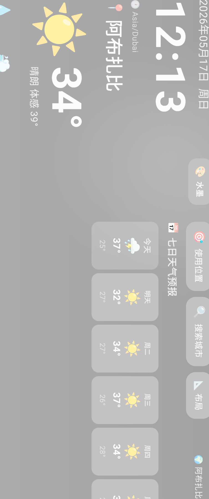
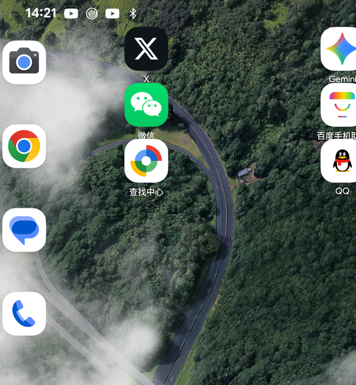
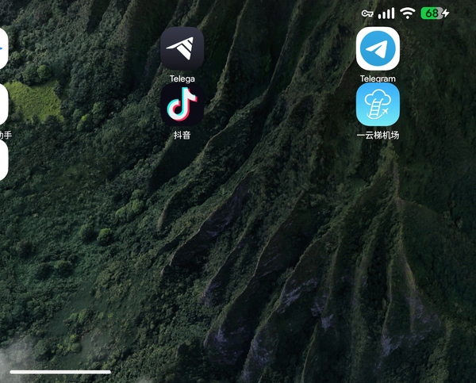

# WeatherClock 天气时钟

<div align="center">
  
  <p>
    <strong>一款专为电视、平板、桌面音响打造的全景天气时钟</strong><br/>
    横屏显示 · 实时天气 · 多主题 · 位置时区自动切换
  </p>
  <p>
    
    
    
    
    
  </p>
</div>

---

## 📺 功能特性

### 核心功能
- **实时天气预报** — 今日天气 + 未来7天预报（温度/降雨概率/天气图标）
- **空气质量真实数据** — Open-Meteo Air Quality API 免费数据，AQI/PM2.5/PM10/O₃/NO₂/CO 六大指标
- **全球城市支持** — 84个全球主要城市，中文名/拼音/拼音首字母搜索
- **位置自动切换** — 自动识别所在城市，时区跟着位置走
- **横屏沉浸显示** — 全屏无状态栏，完美适配电视、平板、桌面智能音响

### 城市管理
- **收藏城市** — ⭐ 标记最爱城市，一键切换
- **置顶城市** — 📌 将常用城市固定在最前面
- **最近访问** — 🕐 自动记录最近使用的城市
- **A-Z 快速导航** — 侧边拼音首字母栏，点击即时跳转

### 9 套主题风格

| 主题 | 风格描述 |
|------|---------|
| 🌓 自动 | 跟随当地时间自动切换昼夜 |
| ☀️ 晴昼 | 蓝天白云，明媚清新 |
| 🌅 黄昏 | 暖橙晚霞，浪漫氛围 |
| 🌙 星空 | 深邃夜空，静谧安宁 |
| 🌲 森林 | 翠绿自然，清新淡雅 |
| 🌊 海洋 | 蓝白渐变，开阔宁静 |
| 🖋️ 水墨 | 中国水墨画风格，黑白灰层次 |
| 📱 简约 | 极简留白，信息清晰 |
| 🌦️ 动态天气 | 雨/雪/雷暴粒子沉浸动效 |

### 自定义布局
- **📐 布局编辑器** — 拖拽调整各区块显示顺序
- **5 个可编辑区域** — 顶部主信息区、左侧面板、右侧面板、左下角、右下角
- **10 种区块类型** — 时钟、日期、温度、7日预报、详情、空气质量、日出日落、位置、主题切换、间距
- **快速模板** — 默认/极简/信息全开

---

## 🖼️ 主题预览

> 完整截图见 [`docs/screenshots/`](docs/screenshots/)

### 主界面预览



| 左面板（时钟/天气） | 右面板（7日预报） |
|:---:|:---:|
|  |  |

### 部分主题效果

| 晴昼 | 黄昏 | 星空 |
|:---:|:---:|:---:|
|  |  |  |
| ☀️ 晴昼 | 🌅 黄昏 | 🌙 星空 |

| 森林 | 海洋 | 水墨 |
|:---:|:---:|:---:|
|  |  |  |
| 🌲 森林 | 🌊 海洋 | 🖋️ 水墨 |

| 简约 | 动态天气-雨 |
|:---:|:---:|
|  |  |
| 📱 简约 | 🌦️ 动态天气（雨）|

---

## 🛠️ 技术架构

| 层级 | 技术 |
|------|------|
| **UI 框架** | Jetpack Compose + Material 3 |
| **架构模式** | MVVM（ViewModel + StateFlow） |
| **数据层** | Kotlin Coroutines + StateFlow |
| **天气 API** | [Open-Meteo](https://open-meteo.com/)（免费，无需 API Key）|
| **空气质量 API** | [Open-Meteo Air Quality](https://open-meteo.com/)（免费）|
| **序列化** | Kotlinx Serialization JSON |
| **最低支持** | Android 6.0（API 23）至 Android 16（API 36） |

---

## 📁 项目结构

```
WeatherClock/
├── app/
│   ├── src/main/
│   │   ├── java/com/example/weatherclock/
│   │   │   ├── MainActivity.kt          # 全屏横屏 + 生命周期
│   │   │   ├── data/
│   │   │   │   ├── Models.kt            # 数据模型（城市/天气/主题/布局）
│   │   │   │   ├── WeatherRepository.kt  # Open-Meteo API 封装
│   │   │   │   ├── LocationProvider.kt  # GPS 定位
│   │   │   │   ├── ThemeDefinitions.kt  # 9 套主题色定义
│   │   │   │   └── AppSettings.kt       # SharedPreferences 持久化
│   │   │   └── ui/
│   │   │       ├── theme/Theme.kt       # Material 3 主题配置
│   │   │       └── main/
│   │   │           ├── MainScreen.kt    # 主界面（含粒子系统/搜索/布局编辑器）
│   │   │           └── MainScreenViewModel.kt  # 业务逻辑
│   │   ├── res/
│   │   │   ├── mipmap-*/               # 应用图标（多密度）
│   │   │   └── drawable/               # 主题图标资源
│   │   └── AndroidManifest.xml
│   └── build.gradle.kts
├── docs/
│   ├── icon.png                        # 应用图标展示
│   └── screenshots/                    # 主题效果图
├── .github/workflows/
│   └── build.yml                       # GitHub Actions 自动编译
└── README.md
```

---

## 🚀 快速开始

### 环境要求
- Android SDK 36
- JDK 17+
- Gradle 9.1.0

### 本地编译

```bash
# 克隆项目
git clone https://github.com/stevenliuit/DeskWeather.git
cd WeatherClock

# 编译 Debug APK（全架构）
./gradlew assembleDebug

# 编译 Release APK
./gradlew assembleRelease

# 单架构编译（更快）
./gradlew assembleDebug -Pandroid.ndk.abiFilters=arm64-v8a
```

### APK 输出位置
```
app/build/outputs/apk/debug/
├── app-armeabi-v7a-debug.apk     # ARM 32位 (老旧设备)
├── app-arm64-v8a-debug.apk        # ARM 64位 (主流手机/电视)
├── app-x86-debug.apk              # x86 (模拟器)
├── app-x86_64-debug.apk           # x86_64 (模拟器/部分设备)
└── app-universal-debug.apk        # 全架构合一 APK
```

---

## 🤖 GitHub Actions 自动编译

每次 `push` 和 `pull request` 到 `main` 分支自动触发：

| 分支 | 触发条件 | 产物 |
|------|---------|------|
| `main` | push / PR | 4 个单架构 APK + 1 个 universal APK |

下载Artifacts：`app/build/outputs/apk/` 下所有 APK

---

## 📡 API 数据来源

| 数据 | 来源 | 说明 |
|------|------|------|
| 天气预报 | [Open-Meteo Weather API](https://open-meteo.com/en/docs) | 免费，无需注册 |
| 空气质量 | [Open-Meteo Air Quality API](https://open-meteo.com/en/docs/air-quality) | 免费，每小时更新 |
| 定位服务 | Google Fused Location Provider | 设备GPS/WiFi/基站 |

---

## 📄 兼容性

| 项目 | 最低版本 | 最高版本 |
|------|---------|---------|
| Android 系统 | 6.0 Marshmallow (API 23) | 16 VanillaiIceCream (API 36) |
| 设备类型 | 手机、平板、电视、桌面智能音响 | — |
| 屏幕方向 | 横屏（强制） | — |
| 屏幕方向传感器 | landscape（自动旋转支持）| — |

---

## 📄 许可证

MIT License — 可自由使用、修改和分发

---

## 🙏 致谢

- 天气数据：[Open-Meteo](https://open-meteo.com/)
- Compose UI：[Jetpack Compose](https://developer.android.com/compose)
- 图标素材：Unicode Emoji（跨平台无需额外资源）